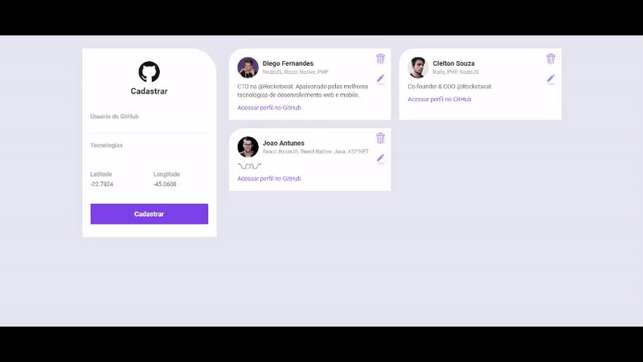

<h1 align="center">
  
<br>
Omnistack 10 - DevRadar
</h1>

<p align="center"> 🚀 DevRadar: Aplicação desenvolvida na 10° semana da Ominstack feito pela Rocketseat.

<p align="center">
  <a href="https://opensource.org/licenses/MIT">
    
  </a>
</p>

## Features
Utilização de API do Github e artifícios de localização com a utilização de:

- ⚛️ **React Js** — Livraria JavaScript para construção de interfaces
- ⚛️ **React Native** — Livraria que provê uma maneira eficiente de criar aplicações nativas para Android e iOS
- 💹 **Node Js** — Web framework que permite utilizar javascript tanto no frontend quanto no backend

## Getting started

<h1 align="center"></img></h1>

### Instalação - Backend
Configure o MongoDB e atualize a string de conexão com seu `User:Senha` no arquivo `index.js`.  
Para instalar as dependências e executar o **Servidor** (modo desenvolvimento), clone o projeto em seu computador e em seguida execute:
```bash
cd backend
yarn install
yarn dev
```

### Instalação - Frontend
Para iniciar o **Frontend** do React utilize os comandos:
```bash
cd frontend
yarn install
yarn start
```
Assim que o processo terminar, automaticamente será aberta no seu navegador a página `localhost:3000` contendo o Projeto desenvolvido no dia 3 de 5.  

### Mobile

Resultado da aplicação mobile utilizando WebSockets:

<h1 align="center"></img></h1>
<br>

Para ver a aplicação mobile com o React Native primeiro é necessário colocar o IP do seu servidor (ou computador) no arquivo `src/services/api.js`, e depois executar os comandos:
```bash
# NÃO é preciso executar a linha de baixo caso ja tenha o Expo (CLI) instalado
yarn global add install expo-cli
cd mobile
yarn install
yarn start
```
Assim que o processo terminar, automaticamente será aberta no seu navegador a página `localhost:19002`. Conecte seu emulador, ou teste o aplicativo por `LAN`: baixe o aplicativo *Expo* da Play Store ou App Store e em seguida escaneie o código QR.


### Insomnia 
Para testar a API do DevRadar, baixe e instale o [Insomnia](https://insomnia.rest/download/) e em seguida clique na Workspace → `Import/Export` → `Import Data` → `From File` → e selecione o arquivo ` 	Insomnia_export.json` deste repositório.

## Licença

Esse projeto é licensiado pela MIT License - Veja a página da [licença](https://opensource.org/licenses/MIT) para detalhes
